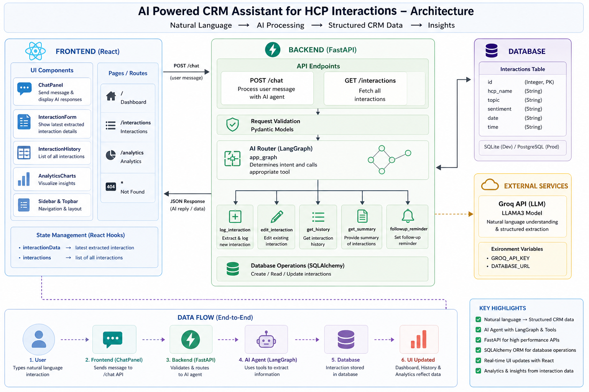

# 🤖 AI CRM Assistant (HCP Interaction Logger)

An AI-powered CRM system that allows users to log Healthcare Professional (HCP) interactions using natural language.

---

## 🚀 Overview

This project helps pharmaceutical representatives log interactions with doctors simply by typing messages like:

> "I met Dr Raju and discussed insulin and he was positive"

The system automatically:

* Extracts structured data
* Stores it in database
* Updates dashboard and analytics in real-time

---

## 🎯 Features

* 💬 AI Chat-based interaction logging
* 🧠 Automatic data extraction (HCP, topic, sentiment)
* 📊 Dashboard with real-time stats
* 📈 Analytics (charts for sentiment & topics)
* 📋 Interaction history table
* 🔍 Persistent data (PostgreSQL)

---

## 🏗️ Tech Stack

### Frontend

* React
* Tailwind CSS
* Axios
* Recharts

### Backend

* FastAPI
* SQLAlchemy
* Pydantic
* Uvicorn

### AI

* LangGraph
* Groq LLM

### Database

* PostgreSQL (Production)
* SQLite (Development)

---

## ⚙️ Installation & Setup

### 1️⃣ Clone repo

```bash
git clone <your-repo-url>
cd ai-crm-hcp
```

---

### 2️⃣ Backend Setup

```bash
cd backend
python -m venv venv
venv\Scripts\activate
pip install -r requirements.txt
```

Create `.env` file:

```env
GROQ_API_KEY=your_api_key
DATABASE_URL=your_postgres_url
```

Run backend:

```bash
uvicorn main:app --reload
```

---

### 3️⃣ Frontend Setup

```bash
cd frontend
npm install
npm start
```

---

## 🔄 How It Works

1. User types interaction in chat
2. Frontend sends request to FastAPI
3. AI extracts structured data
4. Backend stores data in database
5. UI updates automatically:

   * Dashboard
   * Charts
   * History table

---

## 📊 Screenshot


---

## 📌 Example Input

```
I met Dr Meena and discussed diabetes and she was negative
```

### Output:

* HCP Name: Dr Meena
* Topic: Diabetes
* Sentiment: Negative

---

## ⚠️ Challenges & Solutions

* AI returning inconsistent JSON → handled with parsing logic
* Data flow mismatch → standardized response format
* Duplicate DB writes → centralized insertion in backend
* Routing issues → fixed using React Router

---

## 🔮 Future Improvements

* Authentication system
* Better AI intent classification
* Editable interaction form
* Pagination & filters
* Deployment (Docker + Cloud)

---

## 👨‍💻 Author

Abhilash Addagatla
B.Tech CSE (AIML)
Warangal, Telangana

---

## ⭐ If you like this project

Give it a ⭐ on GitHub!

